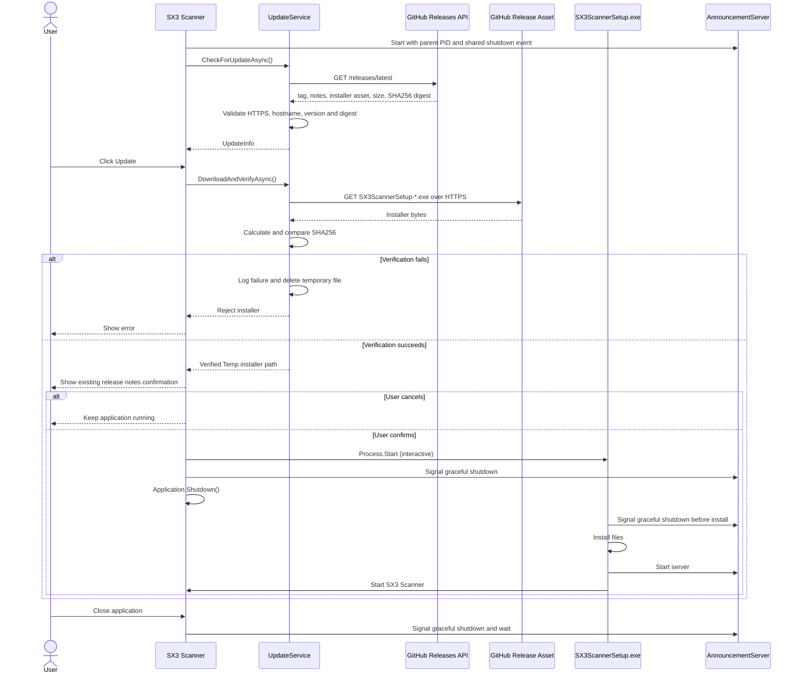

# SX3 Scanner Auto Update

The updater never replaces the running executable. It downloads to
`%TEMP%\SX3Scanner\Updates\SX3ScannerSetup.exe`, requires the GitHub asset
`digest` to contain SHA256, verifies the file, asks for confirmation, and only
then starts the interactive installer.

`version.json` remains in the repository only as a migration manifest for
legacy clients through v7.2.2. `UpdateService` does not read it.
